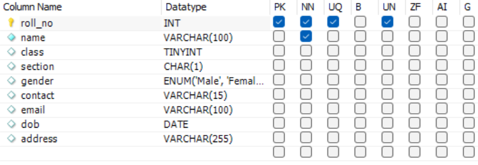
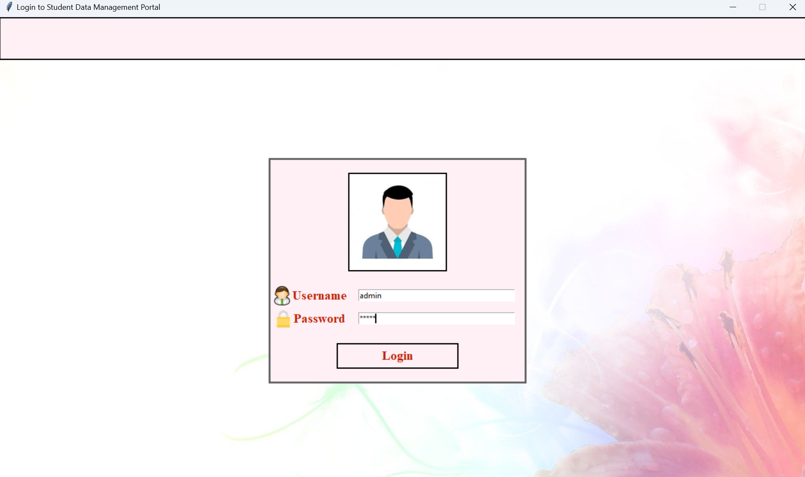
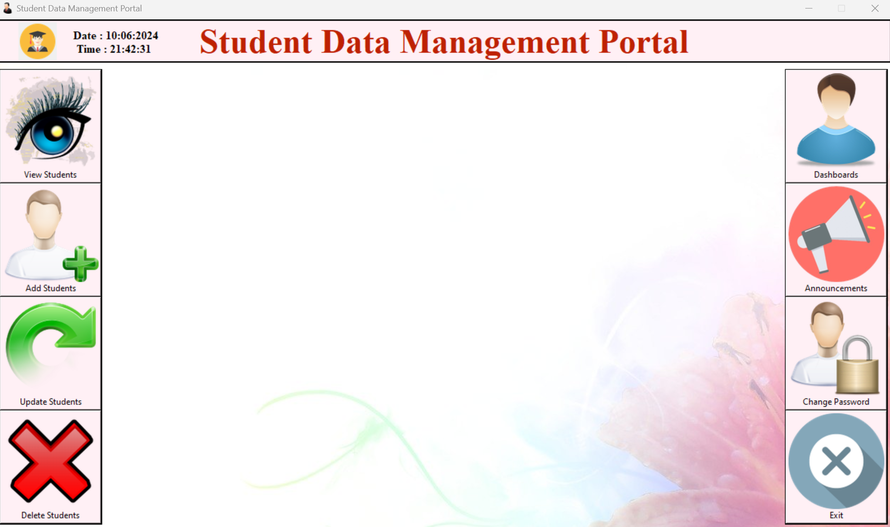
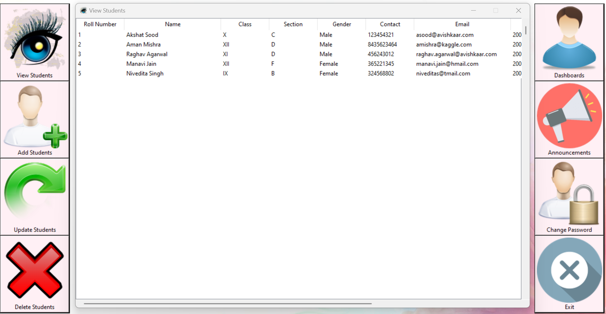
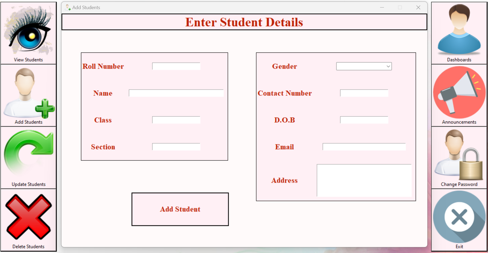
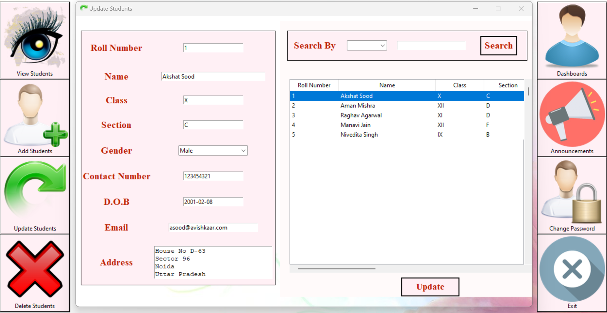
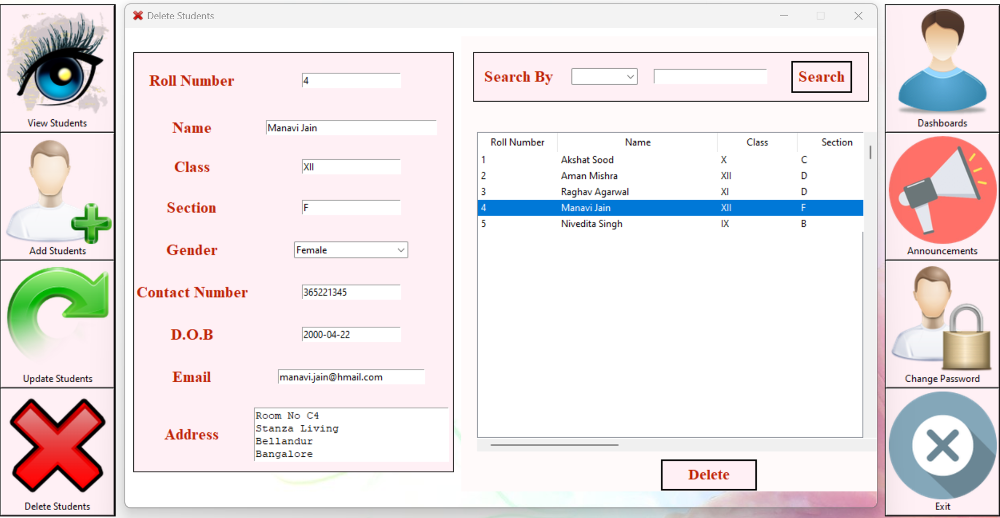
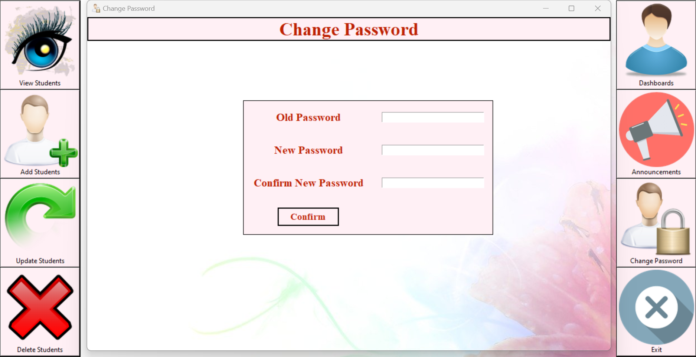

<h2 align="center">Avishkaar - Student Data Management Portal</h2>

<div>
In the bustling corridors of educational institutions 📚, administrators are constantly overwhelmed with the sheer volume of student data they must manage. From enrollment records 📝 and attendance logs 📊 to academic performance 📈 and personal details 🧑‍🎓, the task is monumental. Recognizing this challenge, I set out to create Avishkaar, a Student Data Management Portal 💻 that transforms how educational institutions handle data.
</div><br>

<div>
   <b>Avishkaar</b> serves as a <b>Student Data Management Portal</b>, featuring a <b>Tkinter-based Frontend</b> integrated with <b>MySQL</b> as its Backend Database. The seamless connection and interaction with the database is facilitated by the <code>mysql-connector-python</code> package, empowering the Frontend to access and manipulate data stored in database. However Avishkaar is more than just a archive for student data. It embodies an ambitious vision for elevating data management and manipulation to new heights. At its current stage, the application caters to the administrative domain by providing essential functionalities for administering student data in a methodial manner.<br><br>
</div>

```
                +-------------------+
                |      Tkinter      |
                |   (Client Side)   |
                +--------+----------+
                         |
                         | User Input
                         v
            +------------+------------------+
            |    mysql-connector-python     |
            |      (Data Processing)        |
            +------------+------------------+
                         |
                         | SQL Queries
                         v
                +--------+----------+
                |     MySQL DB      |
                |  (Server Side)    |
                +-------------------+

```

<br><div>
The file <code>credentials.json</code> stores credentials required to run the application. It contains the following:
<ul>
   <li><code>log_pass</code> : current login password</li>
   <li><code>passwd</code> : access password to the database</li>
   <li><code>dbname</code> : database name</li>
</ul>
</div>

```json
{
   "log_pass": "admin",
   "passwd": "DATABAE_PASSWORD",
   "dbname": "DATABASE_NAME"
}
```

<br><div>
   The following diagram depicts the <b>schema of the MySQL database</b>, encompassing crucial student information such as roll number, name, class, section, gender, contact number, email, date of birth, and address. The roll number is designated as <b>PK</b> (Primary Key) and <b>UQ</b> (Unique Index), ensuring each student is allocated a distinct identifier.<br><br>
   <br>
</div>

<br><div>
   Welcome to the Login Page! Please provide your Username and Password to access the Portal. The default credentials are both set to "admin." You can easily change the password later from the Portal.
</div>
<br>
<br><br>

<div>After a successful login, the user is greeted with a window showcasing the Portal interface, which includes 8 Buttons (4 on each side). These buttons offer a range of functionalities:</div>
<br>
<br><br>

<div>
   <b>VIEW STUDENTS:</b> Enables user to access and view records of all students stored in the database in a tabular format.<br>
</div>
<br>
<br> 

<b>ADD STUDENTS:</b> Empowers the user to add student records to the database populating the following fields:
<br>
<ul>
   <li>Roll Number</li>
   <li>Name of Student</li>
   <li>Section</li>
   <li>Class</li>
   <li>Gender</li>
   <li>Contact Number</li>
   <li>Date of Birth</li>
   <li>Email</li>
   <li>Address</li>
</ul>
Please note that the <b>Roll Number</b> holds fundamental significance for each student and cannot be shared with others. Hence, the portal strictly prohibits the duplication of roll numbers for multiple students. Furthermore, it is crucial to fill at least the Roll Number and Name of the Student. Other details can be updated later thorugh the Portal.<br><br>
<br>

<b>UPDATE STUDENTS: </b> If you have entered incorrect details or missed some entries, don't fret! The portal allows you to update student records at your convenience. One of its most fascinating features for smooth operation is the Search functionality. Users can easily search for a particular student using the following fields:
<ul>
   <li>Roll Number</li>
   <li>Name</li>
   <li>Contact Number</li>
   <li>Class</li>
   <li>Section</li>
   <li>Email</li>
</ul>
Leverage the search feature and get the results displayed in the table positioned on the right to locate the student for whom you wish to update details. Simply clicking on the student entry in the table will automatically populate the fields located on the left. From there, you can update any desired field. Once you are finished, use the <b>Update</b> button to apply the modifications and get them relfected in the database.<br><br> 
<br>

<b>DELETE STUDENTS: </b> If one of your students has recently left or transferred to another institution, it is crucial to promptly remove their relevant records from the database to prevent any confusion. The Search functionality mentioned above is also available for this purpose. Simply search for the concerned student, click on their entry in the table where the results are displayed, and then use the <b>Delete</b> button to remove them from the database.<br><br>
<br><br>

<b>CHANGE PASSWORD: </b> If you have accidentally revealed your password to someone (well I have done at start :D), don't panic. You can change your password anytime you desire. However, before making the change, users must confirm their old password to ensure authentic access.<br><br>
The login password is retrieved from the <code>credentials.json</code> file. If the validation is successful during the password change process, the new password is written to the JSON, overwriting the previous value.
<br><br>
<br><br>

<b>EXIT: </b> Enables the user to exit the portal and close the portal window. Please note that this button can only be used to close the main portal window and not any other active window.
</p>
<!-- <div>
   Please refer to the video available in the project folder (<code>application-demo.mp4</code>) for a brief walkthrough over the app.
</div> -->

<h3>Setup Instructions</h3>

<blockquote>
   It is recommended to set up a virtual environment to avoid conflicts between package versions installed on your system and keep your workspace organized. To create a virtual environment and activate it, please follow the instructions detailed on <a href="https://docs.python.org/3/library/venv.html">python venv page</a>. The procedure to deactivate the environment is also provided here.
   <br>
</blockquote>

<blockquote>Please note that currently, the application may not be fully responsive on smaller screens, potentially leading to UI breakdowns. I am actively working on UI enhancements to ensure resposive behavior of the Portal.<br>
</blockquote>

<ul>
   <li>Clone the git repo using <code>git clone https://github.com/asood-life/avishkaar.git</code></li>
   <li>Install the required packages using <code>pip install -r requirements.txt</code></li>
   <li>Create a MySQL database following the schema described above. Ensure to specify the database name and required access password in the <code>credentials.json</code> file.</li>
   <li>Run <code>python main.py</code> to launch the application and explore its functionalities.
</ul>

<h3>Future Roadmap</h3>

<ul>
   <li><b>Enhancing Responsiveness and Modularizing Codebase</b>: Ensure the application adjusts to various screen sizes while modularizing the codebase for better organization and easier maintainence.</li>
   <li><b>Announcements</b>: Introduce a feature for publishing announcements and accessing previous ones.</li>
   <li><b>Personalized Dashboards</b>: Incorporate a personalized dashboard for students, showcasing their attendance and grades, courses taken, and other pertinent personal information already recorded in the database.</li>
   <li><b>Bulk Operations</b>: Allow the use of an excel sheet to add or update student details in the database ensuring minimal manual intervention and streamlining of the overall procedure.</li>
</ul>

<hr>
<div>If you find value in this project, please consider giving it a star ⭐ to show your support. Should you encounter any issues or have suggestions for enhancements, feel free to reach out to me or register them under the <a href="https://github.com/asood-life/avishkaar/issues">Issues</a> section.</div>
